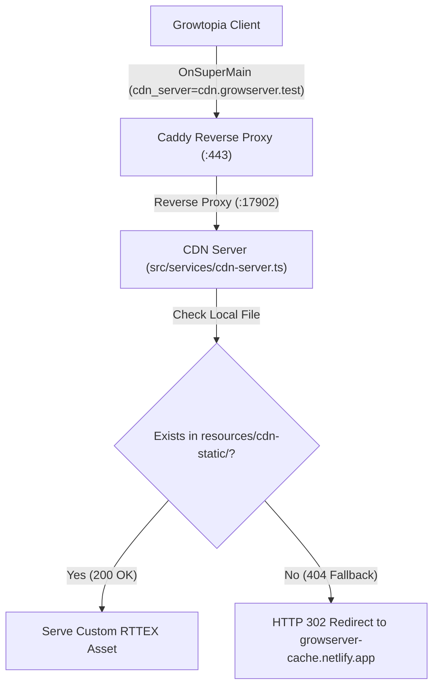

# Custom Items & CDN Assets System

GrowServer provides a unified, declarative system for adding custom items, textures, interface assets, and wiki metadata without manually patching binary files.

---

## 1. Architecture Overview



1. **Client Connection:** When a player joins, [`sendSuperMain()`](file:///D:/Projects/NodeJS_Projects/StileDevs/GrowServ/src/game/packets/variants.ts#L331) informs the client to fetch assets from `cdn.growserver.test` with prefix `growtopia/`.
2. **Reverse Proxy:** Caddy terminates TLS and forwards requests on port 443 to the internal CDN server on port 17902.
3. **Local First:** The CDN server checks [`resources/cdn-static/`](file:///D:/Projects/NodeJS_Projects/StileDevs/GrowServ/resources/cdn-static). If the custom file exists, it is served immediately.
4. **Transparent Fallback:** If the file does not exist locally (such as standard game sprites or audio), the CDN server automatically redirects (HTTP 302) to the upstream archive (`https://growserver-cache.netlify.app`), ensuring 100% asset coverage without storing gigabytes of vanilla game data locally.

---

## 2. Directory Tree Resolution

Custom items reside in [`resources/custom-items/`](file:///D:/Projects/NodeJS_Projects/StileDevs/GrowServ/resources/custom-items/). The directory hierarchy relative to `resources/custom-items/` **directly dictates the compiled asset path**.

### Directory Structure Example:
```text
resources/custom-items/
└── growserver/
    └── interface/
        └── banner/
            ├── conf.toml
            └── banner.png
```

### Path Resolution:
- **Relative Directory:** `growserver/interface/banner`
- **Compiled Asset:** `resources/cdn-static/growserver/interface/banner.rttex`
- **In-Game Items Data (`items.dat`):** `extraFile = "growserver/interface/banner.rttex"`
- **Client Request URL:** `https://cdn.growserver.test/growtopia/growserver/interface/banner.rttex`

This structure prevents naming collisions with vanilla assets (which use vanilla prefixes like `interface/` or `game/`) and keeps all custom assets organized under distinct namespaces (e.g., `growserver/`).

---

## 3. Configuration Reference (`conf.toml`)

Each custom item folder must contain a `conf.toml` file alongside its source `.png` image.

### Full `conf.toml` Example:
```toml
# Target item ID in items.dat (Required)
id = 8900

# Explicit target asset field: "extra_file" or "texture" (Optional)
# If omitted, auto-detected: folders containing "/interface/" default to "extra_file", others default to "texture"
target = "extra_file"

# Modifies in-game item properties in items.dat (Optional)
[item]
name = "GrowServer Banner"
# Additional ItemDefinition fields:
# texture_x = 0
# texture_y = 0
# type = 20
# body_part_type = 6
# visual_effect_type = 4

# Metadata merged into .cache/wiki.json (Optional)
[wiki]
desc = "An exclusive custom banner designed for the GrowServer community."
chi = "water" # "earth" | "wind" | "fire" | "water"
play_mods = ["Speedy"]

[wiki.recipe]
splice = [2, 3] # Item IDs required to splice this item

[wiki.func]
add = "Show off your server pride with this banner."
rem = "Banner removed."
```

### Table Breakdown

#### Root Level
| Key | Type | Required | Description |
|---|---|---|---|
| `id` | `integer` | Yes | Target item ID in `items.dat` to modify or replace. |
| `target` | `string` | No | `"extra_file"` or `"texture"`. Defaults to `"extra_file"` if path contains `interface/`, otherwise `"texture"`. |

#### `[item]` Table
Allows modifying properties on the decoded `ItemDefinition` before re-encoding `items.dat`:
- `name`: Item display name.
- `texture_x`, `texture_y`: Sprite coordinates in texture sheet.
- `type`: Item category type ID (e.g., 20 for clothing).
- `body_part_type`: Clothing slot (e.g., 6 for wings/back).
- `visual_effect_type`: Special effect flags.
- `rarity`, `grow_time`, `break_hits`, etc.

#### `[wiki]` Table
Allows defining or enriching documentation entries in `.cache/wiki.json`:
- `desc`: Item lore or informational description.
- `chi`: Elemental affinity (`"earth"`, `"wind"`, `"fire"`, `"water"`).
- `play_mods`: Array of gameplay modifiers (e.g. `["Speedy", "Enhanced Punch"]`).
- `[wiki.recipe]`:
  - `splice`: Array of two item IDs used for seed splicing.
  - `combine`: Object configuring combiner / chemical transmutator recipe (`items: [{ id: number, amount: number }]`, `result_amount: number`).
- `[wiki.func]`:
  - `add`: Text displayed when item effect or mod is applied.
  - `rem`: Text displayed when item effect is removed.

---

## 4. Build & Compilation Workflow

### 1. Manual Build Command
Compile all custom assets and update metadata manifests:
```bash
bun run build:assets
```

The build process:
1. Discovers all `conf.toml` files in `resources/custom-items/`.
2. Encodes each primary `.png` into Proton `.rttex` via `RTTEX.encode()`.
3. Computes the Proton hash via `RTTEX.hash()`.
4. Saves compiled binary files to `resources/cdn-static/<path>.rttex`.
5. Writes `.cache/custom-items.json` manifest.
6. Merges custom item wiki information into `.cache/wiki.json`.

### 2. Automatic Server Startup Integration
During server boot in [`initItems()`](file:///D:/Projects/NodeJS_Projects/StileDevs/GrowServ/src/game/item/item-info.ts#L145):
- If `.cache/custom-items.json` is missing, `buildAssets()` is executed automatically.
- All compiled item definitions are applied to `items.meta.items`.
- `items.encode()` re-serializes the items database, producing `itemsModifiedHash`.
- When players log in, `sendSuperMain()` sends `itemsModifiedHash` to trigger asset cache synchronization on the client.

---

## 5. Adding a New Custom Item (Step-by-Step)

### Step 1: Create Item Folder
Create a subdirectory under `resources/custom-items/` representing your item category and name:
```bash
mkdir -p resources/custom-items/growserver/game/testing_wing
```

### Step 2: Add Image Asset
Place your sprite sheet or texture as a `.png` file inside the folder:
```text
resources/custom-items/growserver/game/testing_wing/testing_wing.png
```

### Step 3: Configure `conf.toml`
Create `conf.toml` in that directory:
```toml
id = 5136
target = "texture"

[item]
name = "Testing Wing"
texture_x = 1
texture_y = 0
type = 20
body_part_type = 6
visual_effect_type = 4

[wiki]
desc = "A pair of wings forged for testing server flight physics."
play_mods = ["Double Jump"]
```

### Step 4: Compile Assets
```bash
bun run build:assets
```

Start or restart your server with `bun run dev` or `bun run start:local`. When you log into Growtopia, item `5136` will feature your custom texture and properties.
